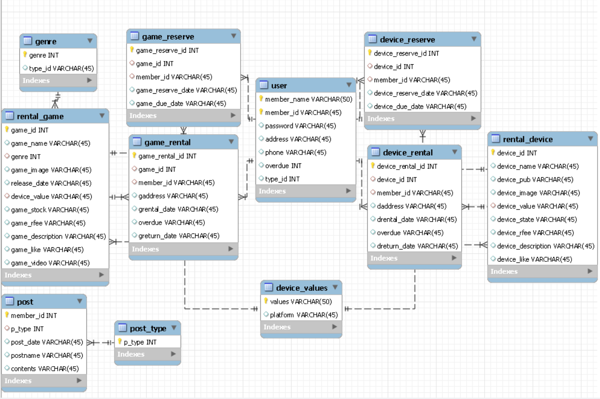

# No Pain No Game
유형별 게임 추천 및 게임·기기 대여 예약 웹서비스

## Introduction
- 개발 기간: 2021.03 ~ 2021.10 
- 2021년도 졸업작품전 동상🥉

## Collaborators
|이름|역할|담당 업무|
|------|------|------|
|xxxx|Frontend|UI/UX 설계, 프론트엔드 개발|
|xxxx|Backend|서버 구축, API 개발|
|xxxx|Full Stack|데이터베이스 설계, 전체 통합|
|xxxx|Design|UI 디자인, 사용자 테스트|

## Service Architecture
- Front Tech Stack
  - HTML5, CSS3, JavaScript
  - Bootstrap
- Backend
  - Django
  - Python
  - SQLite

## Main Feature
- 유형별 테스트를 통해 사용자의 취향을 반영하고 게임 추천 
  

  
  

- 게임과 기기 대여와 예약
- 유형별 게시판 커뮤니티

## Preview

## Service Introduction
### 1. 게임 성향 분석 및 추천
- 사용자 성향 테스트를 통해 4가지 게임 유형 분류
  
- 맞춤형 게임 추천 알고리즘 적용
  

### 2. 게임 기기 및 타이틀 대여
- **지원 기기:** Nintendo Switch, PlayStation 등
- **대여 방식:** 온라인 대여/예약 후 배송
  
- **대여 제한:** 회원당 동시 대여 가능 수량 제한
- **배송 서비스:** 회원 등록 주소로 직접 배송
  

### 3. 유형별 커뮤니티
- 게임 유형별 게시판 운영
- 사용자 간 정보 공유 및 소통
- 게임 리뷰 및 평가 시스템
  

## DB
  

  
  

